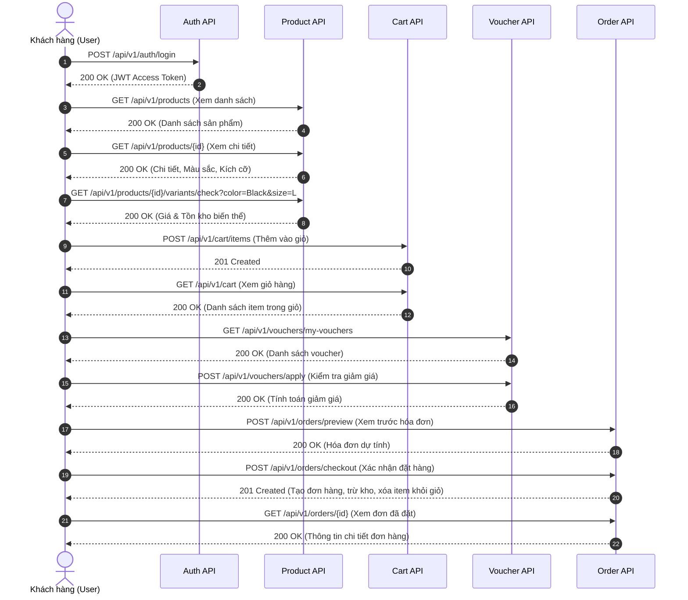

# TÀI LIỆU THIẾT KẾ RESTFUL API (API SPECIFICATION)
> **Dự án:** E-Commerce Backend (Spring Boot & PostgreSQL)  
> **Dựa trên Use Case Diagram:** `UseCase Diagram2.png` & Thiết kế cơ sở dữ liệu `db_design.md`  
> **Phiên bản:** v1.0.0  
> **Base URL:** `/api/v1`

---

## 1. QUY CHUẨN CHUNG (GENERAL CONVENTIONS)

### 1.1. Headers
- `Content-Type: application/json`
- `Authorization: Bearer <JWT_ACCESS_TOKEN>` (Bắt buộc với các endpoint yêu cầu đăng nhập)

### 1.2. Chuẩn định dạng Response (Standard API Response Wrapper)
Tất cả các API tuân thủ cấu trúc `ApiResponse<T>` chung của hệ thống:

```json
{
  "timestamp": "2026-08-27T09:30:00Z",
  "success": true,
  "message": "Thông báo trạng thái thực thi",
  "data": { ... }
}
```

Khi có lỗi (Error Response):
```json
{
  "timestamp": "2026-08-27T09:30:00Z",
  "success": false,
  "message": "Mô tả nguyên nhân lỗi cụ thể",
  "data": null
}
```

### 1.3. Mã trạng thái HTTP (HTTP Status Codes)
- `200 OK`: Yêu cầu thực hiện thành công.
- `201 Created`: Tạo mới tài nguyên thành công (Đăng ký, Thêm vào giỏ, Tạo đơn hàng,...).
- `400 Bad Request`: Dữ liệu đầu vào không hợp lệ hoặc vi phạm ràng buộc nghiệp vụ (hết hàng, voucher không đủ điều kiện,...).
- `401 Unauthorized`: Chưa đăng nhập hoặc Token hết hạn/không hợp lệ.
- `403 Forbidden`: Không có quyền truy cập tài nguyên.
- `404 Not Found`: Không tìm thấy tài nguyên (sản phẩm, giỏ hàng, đơn hàng, voucher,...).
- `409 Conflict`: Xung đột dữ liệu (Email/Username/SKU/Mã voucher đã tồn tại,...).
- `500 Internal Server Error`: Lỗi hệ thống server.

---

## 2. MA TRẬN USE CASE & DANH SÁCH API ENDPOINTS

| Nhóm Use Case | Use Case chi tiết | HTTP Method | Endpoint | Yêu cầu Auth |
| :--- | :--- | :--- | :--- | :---: |
| **1. Xác thực** | Đăng ký | `POST` | `/api/v1/auth/register` | Public |
| | Đăng nhập | `POST` | `/api/v1/auth/login` | Public |
| | Làm mới Token | `POST` | `/api/v1/auth/refresh` | Public |
| | Đăng xuất | `POST` | `/api/v1/auth/logout` | User |
| | Thông tin người dùng hiện tại | `GET` | `/api/v1/users/me` | User |
| **2. Xem hàng** | Xem danh sách hàng hóa | `GET` | `/api/v1/products` | Public |
| | Tìm kiếm hàng theo loại hàng | `GET` | `/api/v1/categories` | Public |
| | Tìm kiếm & Lọc sản phẩm theo loại | `GET` | `/api/v1/products?categoryId={id}` | Public |
| | Xem thông tin chi tiết | `GET` | `/api/v1/products/{id}` | Public |
| | Chuyển/Tra cứu màu & size của hàng | `GET` | `/api/v1/products/{id}/variants` | Public |
| | Tra cứu biến thể theo màu & size | `GET` | `/api/v1/products/{id}/variants/check` | Public |
| **3. Quản lý giỏ hàng** | Quản lý giỏ hàng (Xem giỏ hàng) | `GET` | `/api/v1/cart` | User |
| | Thêm hàng vào giỏ | `POST` | `/api/v1/cart/items` | User |
| | Sửa hàng trong giỏ (số lượng) | `PUT` | `/api/v1/cart/items/{itemId}` | User |
| | Sửa biến thể trong giỏ (đổi size/màu) | `PUT` | `/api/v1/cart/items/{itemId}/variant` | User |
| | Bỏ hàng khỏi giỏ (1 món) | `DELETE` | `/api/v1/cart/items/{itemId}` | User |
| | Bỏ hàng khỏi giỏ (nhiều món đã chọn) | `DELETE` | `/api/v1/cart/items` | User |
| | Xóa sạch giỏ hàng | `DELETE` | `/api/v1/cart/clear` | User |
| **4. Sử dụng voucher** | Xem thông tin voucher (danh sách) | `GET` | `/api/v1/vouchers` | User |
| | Xem chi tiết 1 voucher | `GET` | `/api/v1/vouchers/{code}` | User |
| | Lưu/Nhận voucher vào ví | `POST` | `/api/v1/vouchers/claim` | User |
| | Áp dụng voucher cho đơn hàng | `POST` | `/api/v1/vouchers/apply` | User |
| **5. Đặt đơn hàng** | Thêm thông tin & Xem trước hóa đơn | `POST` | `/api/v1/orders/preview` | User |
| | Xác nhận đặt hàng (Checkout) | `POST` | `/api/v1/orders/checkout` | User |
| | Xem danh sách đơn hàng đã đặt | `GET` | `/api/v1/orders` | User |
| | Xem thông tin chi tiết đơn hàng đã đặt | `GET` | `/api/v1/orders/{id}` | User |
| | Hủy đơn hàng (khi Pending) | `PUT` | `/api/v1/orders/{id}/cancel` | User |

---

## 3. CHI TIẾT TỪNG API THEO TỪNG USE CASE

---

### NHÓM 1: XÁC THỰC (AUTHENTICATION)

#### 1.1. Đăng ký tài khoản (Register)
- **Use Case:** `Đăng ký`
- **Method:** `POST`
- **Endpoint:** `/api/v1/auth/register`
- **Auth:** Public
- **Request Body:**
```json
{
  "username": "nguyenvana",
  "email": "vana@example.com",
  "password": "Password@123",
  "confirmPassword": "Password@123"
}
```
- **Response `201 Created`:**
```json
{
  "timestamp": "2026-08-27T09:30:00Z",
  "success": true,
  "message": "User registered successfully",
  "data": {
    "accessToken": "eyJhbGciOi...",
    "refreshToken": "7d9b925b-...",
    "tokenType": "Bearer",
    "expiresIn": 86400000,
    "user": {
      "id": "e4b5a329-8fb3-4f9e-a0e2-63234d7d1111",
      "username": "nguyenvana",
      "email": "vana@example.com",
      "role": "CUSTOMER"
    }
  }
}
```

---

#### 1.2. Đăng nhập (Login)
- **Use Case:** `Đăng nhập` (Được `<<include>>` bởi các use case: Giỏ hàng, Voucher, Đặt hàng, Xem hàng)
- **Method:** `POST`
- **Endpoint:** `/api/v1/auth/login`
- **Auth:** Public
- **Request Body:**
```json
{
  "loginIdentifier": "vana@example.com",
  "password": "Password@123"
}
```
- **Response `200 OK`:**
```json
{
  "timestamp": "2026-08-27T09:30:00Z",
  "success": true,
  "message": "Login successful",
  "data": {
    "accessToken": "eyJhbGciOi...",
    "refreshToken": "7d9b925b-...",
    "tokenType": "Bearer",
    "expiresIn": 86400000,
    "user": {
      "id": "e4b5a329-8fb3-4f9e-a0e2-63234d7d1111",
      "username": "nguyenvana",
      "email": "vana@example.com",
      "role": "CUSTOMER"
    }
  }
}
```

---

#### 1.3. Làm mới Token (Refresh Token)
- **Method:** `POST`
- **Endpoint:** `/api/v1/auth/refresh`
- **Request Body:**
```json
{
  "refreshToken": "7d9b925b-..."
}
```

---

#### 1.4. Đăng xuất (Logout)
- **Method:** `POST`
- **Endpoint:** `/api/v1/auth/logout`
- **Request Body:**
```json
{
  "refreshToken": "7d9b925b-..."
}
```

---

### NHÓM 2: XEM HÀNG (PRODUCT BROWSING)

#### 2.1. Xem danh sách hàng hóa (Browse Products)
- **Use Case:** `Xem hàng`
- **Method:** `GET`
- **Endpoint:** `/api/v1/products`
- **Auth:** Public
- **Query Parameters:**
  - `page` (int, default: 0)
  - `size` (int, default: 10)
  - `sortBy` (string: "createdAt", "price", default: "createdAt")
  - `sortDir` (string: "ASC", "DESC", default: "DESC")
  - `keyword` (string, optional: tìm kiếm theo tên/mô tả sản phẩm)
  - `minPrice` (decimal, optional)
  - `maxPrice` (decimal, optional)
- **Response `200 OK`:**
```json
{
  "timestamp": "2026-08-27T09:30:00Z",
  "success": true,
  "message": "Products retrieved successfully",
  "data": {
    "content": [
      {
        "id": "11111111-1111-1111-1111-111111111111",
        "name": "Áo Polo Nam Classic Fit",
        "description": "Chất liệu cotton thoáng mát cao cấp",
        "primaryImageUrl": "https://example.com/images/polo-main.jpg",
        "minPrice": 250000.00,
        "maxPrice": 290000.00,
        "totalStock": 150,
        "categories": [
          { "id": "cat-uuid-1", "name": "Nam" }
        ],
        "tags": [
          { "id": "tag-uuid-1", "code": "NEW_ARRIVAL", "name": "Hàng Mới" }
        ]
      }
    ],
    "pageNo": 0,
    "pageSize": 10,
    "totalElements": 45,
    "totalPages": 5,
    "last": false
  }
}
```

---

#### 2.2. Tìm kiếm hàng theo loại hàng (Search/Filter by Category)
- **Use Case:** `Tìm kiếm hàng theo loại hàng` (`<<extend>>` từ `Xem hàng`)
- **API 1 - Lấy danh mục:** `GET /api/v1/categories`
- **API 2 - Lọc sản phẩm theo danh mục/thẻ:**
  - **Method:** `GET`
  - **Endpoint:** `/api/v1/products`
  - **Query Parameters:**
    - `categoryId` (UUID, optional: Lọc theo danh mục sản phẩm)
    - `tagId` (UUID, optional: Lọc theo nhãn/tag)
    - `keyword` (string, optional: Từ khóa tìm kiếm)
- **Response `200 OK`:** Trả về danh sách sản phẩm thuộc loại hàng đã chọn.

---

#### 2.3. Xem thông tin chi tiết sản phẩm (Product Details)
- **Use Case:** `Xem thông tin chi tiết` (`<<extend>>` từ `Xem hàng`)
- **Method:** `GET`
- **Endpoint:** `/api/v1/products/{id}`
- **Auth:** Public
- **Response `200 OK`:**
```json
{
  "timestamp": "2026-08-27T09:30:00Z",
  "success": true,
  "message": "Product detail retrieved successfully",
  "data": {
    "id": "11111111-1111-1111-1111-111111111111",
    "name": "Áo Polo Nam Classic Fit",
    "description": "Chất liệu cotton 100%, co giãn 4 chiều...",
    "categories": [
      { "id": "c1-uuid", "name": "Nam" },
      { "id": "c2-uuid", "name": "Áo Polo" }
    ],
    "tags": [
      { "id": "t1-uuid", "code": "BEST_SELLER", "name": "Bán chạy" }
    ],
    "images": [
      {
        "id": "img-1",
        "imageUrl": "https://example.com/images/polo-black.jpg",
        "color": "Black",
        "isPrimary": true,
        "indexOrder": 1
      },
      {
        "id": "img-2",
        "imageUrl": "https://example.com/images/polo-white.jpg",
        "color": "White",
        "isPrimary": false,
        "indexOrder": 2
      }
    ],
    "availableColors": ["Black", "White", "Navy"],
    "availableSizes": ["M", "L", "XL"],
    "variants": [
      {
        "id": "var-1-uuid",
        "sku": "5S-POLO-BLK-M",
        "color": "Black",
        "size": "M",
        "price": 250000.00,
        "quantity": 25,
        "imageUrl": "https://example.com/images/polo-black.jpg"
      },
      {
        "id": "var-2-uuid",
        "sku": "5S-POLO-BLK-L",
        "color": "Black",
        "size": "L",
        "price": 250000.00,
        "quantity": 30,
        "imageUrl": "https://example.com/images/polo-black.jpg"
      }
    ]
  }
}
```

---

#### 2.4. Chuyển các loại màu, size của hàng (Switch Colors & Sizes)
- **Use Case:** `Chuyển các loại màu, size của hàng` (`<<extend>>` từ `Xem hàng`)
- **Mô tả:** Khi khách hàng nhấp chọn màu sắc hoặc kích thước trên màn hình, API này trả về thông tin giá, số lượng tồn kho và hình ảnh tương ứng của biến thể.
- **Method:** `GET`
- **Endpoint:** `/api/v1/products/{id}/variants/check`
- **Query Parameters:**
  - `color` (string, required: ví dụ `Black`)
  - `size` (string, required: ví dụ `L`)
- **Response `200 OK`:**
```json
{
  "timestamp": "2026-08-27T09:30:00Z",
  "success": true,
  "message": "Variant fetched successfully",
  "data": {
    "variantId": "var-2-uuid",
    "sku": "5S-POLO-BLK-L",
    "color": "Black",
    "size": "L",
    "price": 250000.00,
    "stockQuantity": 30,
    "isAvailable": true,
    "imageUrl": "https://example.com/images/polo-black.jpg"
  }
}
```

---

### NHÓM 3: QUẢN LÝ GIỎ HÀNG (CART MANAGEMENT)
*(Tất cả API nhóm này yêu cầu Header: `Authorization: Bearer <Token>`)*

#### 3.1. Quản lý giỏ hàng / Xem giỏ hàng (Get Cart)
- **Use Case:** `Quản lý giỏ hàng`
- **Method:** `GET`
- **Endpoint:** `/api/v1/cart`
- **Auth:** User
- **Response `200 OK`:**
```json
{
  "timestamp": "2026-08-27T09:30:00Z",
  "success": true,
  "message": "Cart retrieved successfully",
  "data": {
    "cartId": "cart-uuid-1",
    "totalItems": 3,
    "totalQuantity": 5,
    "subtotalAmount": 1250000.00,
    "items": [
      {
        "cartItemId": "item-uuid-1",
        "productVariantId": "var-2-uuid",
        "productId": "11111111-1111-1111-1111-111111111111",
        "productName": "Áo Polo Nam Classic Fit",
        "sku": "5S-POLO-BLK-L",
        "color": "Black",
        "size": "L",
        "thumbnailUrl": "https://example.com/images/polo-black.jpg",
        "unitPrice": 250000.00,
        "quantity": 2,
        "totalPrice": 500000.00,
        "stockAvailable": 30
      }
    ]
  }
}
```

---

#### 3.2. Thêm hàng vào giỏ (Add to Cart)
- **Use Case:** `Thêm hàng vào giỏ` (`<<extend>>` từ `Quản lý giỏ hàng`)
- **Method:** `POST`
- **Endpoint:** `/api/v1/cart/items`
- **Auth:** User
- **Request Body:**
```json
{
  "productVariantId": "var-2-uuid",
  "quantity": 2
}
```
- **Xử lý nghiệp vụ:**
  - Kiểm tra `productVariantId` có tồn tại không.
  - Kiểm tra tồn kho `product_variants.quantity >= requested quantity`.
  - Nếu sản phẩm đã có trong giỏ, cộng dồn `quantity` (kiểm tra không vượt quá tồn kho).
- **Response `201 Created`:**
```json
{
  "timestamp": "2026-08-27T09:30:00Z",
  "success": true,
  "message": "Item added to cart successfully",
  "data": {
    "cartItemId": "item-uuid-1",
    "productVariantId": "var-2-uuid",
    "quantity": 2,
    "totalCartItems": 3
  }
}
```

---

#### 3.3. Sửa hàng trong giỏ (Update Cart Item)
- **Use Case:** `Sửa hàng trong giỏ` (`<<extend>>` từ `Quản lý giỏ hàng`)
- **Method:** `PUT`
- **Endpoint:** `/api/v1/cart/items/{cartItemId}`
- **Auth:** User
- **Request Body:**
```json
{
  "quantity": 3
}
```
- **Response `200 OK`:**
```json
{
  "timestamp": "2026-08-27T09:30:00Z",
  "success": true,
  "message": "Cart item updated successfully",
  "data": {
    "cartItemId": "item-uuid-1",
    "quantity": 3,
    "unitPrice": 250000.00,
    "totalPrice": 750000.00
  }
}
```

---

#### 3.4. Bỏ hàng khỏi giỏ (Remove from Cart)
- **Use Case:** `Bỏ hàng khỏi giỏ` (`<<extend>>` từ `Quản lý giỏ hàng`)
- **API 1 - Bỏ 1 sản phẩm:**
  - **Method:** `DELETE`
  - **Endpoint:** `/api/v1/cart/items/{cartItemId}`
- **API 2 - Bỏ nhiều sản phẩm (Bulk Delete):**
  - **Method:** `DELETE`
  - **Endpoint:** `/api/v1/cart/items`
  - **Request Body:**
    ```json
    {
      "cartItemIds": ["item-uuid-1", "item-uuid-2"]
    }
    ```
- **API 3 - Xóa toàn bộ giỏ hàng:**
  - **Method:** `DELETE`
  - **Endpoint:** `/api/v1/cart/clear`
- **Response `200 OK`:**
```json
{
  "timestamp": "2026-08-27T09:30:00Z",
  "success": true,
  "message": "Item(s) removed from cart successfully",
  "data": null
}
```

---

### NHÓM 4: SỬ DỤNG VOUCHER (VOUCHER & PROMOTIONS)
*(Tất cả API nhóm này yêu cầu Header: `Authorization: Bearer <Token>`)*

#### 4.1. Xem thông tin voucher (View Voucher List & Details)
- **Use Case:** `Xem thông tin voucher` (`<<extend>>` từ `Sử dụng voucher`)
- **API 1 - Danh sách voucher khả dụng của User:**
  - **Method:** `GET`
  - **Endpoint:** `/api/v1/vouchers/my-vouchers`
- **API 2 - Tra cứu chi tiết 1 voucher bằng mã Code:**
  - **Method:** `GET`
  - **Endpoint:** `/api/v1/vouchers/{code}`
- **Response `200 OK`:**
```json
{
  "timestamp": "2026-08-27T09:30:00Z",
  "success": true,
  "message": "Voucher details retrieved successfully",
  "data": {
    "id": "vouch-uuid-1",
    "code": "SUMMER2026",
    "discountType": "PERCENTAGE",
    "value": 15.00,
    "maxDiscountAmount": 100000.00,
    "minimumSpend": 300000.00,
    "validFrom": "2026-06-01T00:00:00Z",
    "validUntil": "2026-08-31T23:59:59Z",
    "isClaimed": true,
    "usageLeft": 1,
    "description": "Giảm 15% tối đa 100k cho đơn từ 300k"
  }
}
```

---

#### 4.2. Lưu voucher vào tài khoản (Claim Voucher)
- **Use Case:** `Sử dụng voucher`
- **Method:** `POST`
- **Endpoint:** `/api/v1/vouchers/claim`
- **Request Body:**
```json
{
  "voucherCode": "SUMMER2026"
}
```
- **Response `200 OK`:**
```json
{
  "timestamp": "2026-08-27T09:30:00Z",
  "success": true,
  "message": "Voucher claimed successfully",
  "data": {
    "voucherCode": "SUMMER2026",
    "usageLimit": 1
  }
}
```

---

#### 4.3. Áp dụng voucher cho đơn hàng (Apply Voucher to Order)
- **Use Case:** `Áp dụng voucher cho đơn hàng` (`<<extend>>` từ `Sử dụng voucher`)
- **Mô tả:** Tính toán số tiền được giảm khi áp dụng voucher vào đơn hàng/giỏ hàng trước khi xác nhận đặt mua.
- **Method:** `POST`
- **Endpoint:** `/api/v1/vouchers/apply`
- **Request Body:**
```json
{
  "voucherCode": "SUMMER2026",
  "subtotalAmount": 500000.00
}
```
- **Xử lý nghiệp vụ:**
  - Kiểm tra `voucherCode` hợp lệ, trong thời hạn (`validFrom <= now <= validUntil`).
  - Kiểm tra `subtotalAmount >= minimumSpend`.
  - Kiểm tra số lần sử dụng của user (`usage < usage_limit`).
  - Tính tiền giảm: `discountAmount = (discountType == PERCENTAGE) ? min(subtotal * value%, maxDiscountAmount) : value`.
- **Response `200 OK`:**
```json
{
  "timestamp": "2026-08-27T09:30:00Z",
  "success": true,
  "message": "Voucher applied successfully",
  "data": {
    "voucherId": "vouch-uuid-1",
    "voucherCode": "SUMMER2026",
    "discountType": "PERCENTAGE",
    "subtotalAmount": 500000.00,
    "discountAmount": 750000.00,
    "finalAmount": 425000.00,
    "isValid": true
  }
}
```

---

### NHÓM 5: ĐẶT ĐƠN HÀNG (ORDER PLACEMENT & CHECKOUT)
*(Tất cả API nhóm này yêu cầu Header: `Authorization: Bearer <Token>`)*

#### 5.1. Thêm thông tin & Xem trước đơn hàng (Checkout Preview)
- **Use Case:** `Thêm thông tin đơn hàng` (`<<extend>>` từ `Đặt đơn hàng`)
- **Mô tả:** Người dùng nhập địa chỉ nhận hàng, chọn các mặt hàng từ giỏ và voucher để hệ thống tính toán chi tiết phí ship và tổng tiền thanh toán trước khi bấm xác nhận.
- **Method:** `POST`
- **Endpoint:** `/api/v1/orders/preview`
- **Request Body:**
```json
{
  "cartItemIds": [
    "item-uuid-1",
    "item-uuid-2"
  ],
  "voucherCode": "SUMMER2026",
  "shippingAddress": "123 Đường Nguyễn Huệ, Quận 1, TP. HCM"
}
```
- **Response `200 OK`:**
```json
{
  "timestamp": "2026-08-27T09:30:00Z",
  "success": true,
  "message": "Order preview calculated successfully",
  "data": {
    "subtotalAmount": 500000.00,
    "shippingFee": 30000.00,
    "discountAmount": 75000.00,
    "finalAmount": 455000.00,
    "voucher": {
      "code": "SUMMER2026",
      "discountAmount": 75000.00
    },
    "items": [
      {
        "productVariantId": "var-2-uuid",
        "productName": "Áo Polo Nam Classic Fit",
        "sku": "5S-POLO-BLK-L",
        "color": "Black",
        "size": "L",
        "thumbnailUrl": "https://example.com/images/polo-black.jpg",
        "quantity": 2,
        "unitPrice": 250000.00,
        "totalPrice": 500000.00
      }
    ]
  }
}
```

---

#### 5.2. Xác nhận đặt hàng (Confirm / Place Order)
- **Use Case:** `Xác nhận đặt hàng` (`<<extend>>` từ `Đặt đơn hàng`)
- **Mô tả:** Tạo đơn hàng chính thức, ghi nhận snapshot dữ liệu mặt hàng (`order_items`), trừ tồn kho biến thể (`product_variants.quantity`), ghi nhận lượt dùng voucher (`user_voucher.usage`), và xóa các item tương ứng trong `cart_items`.
- **Method:** `POST`
- **Endpoint:** `/api/v1/orders/checkout`
- **Request Body:**
```json
{
  "recipientName": "Nguyễn Văn A",
  "phoneNumber": "0987654321",
  "address": "123 Đường Nguyễn Huệ, Phường Bến Nghé, Quận 1, TP. HCM",
  "description": "Giao hàng giờ hành chính, gọi trước khi đến",
  "voucherCode": "SUMMER2026",
  "cartItemIds": [
    "item-uuid-1"
  ]
}
```
- **Xử lý nghiệp vụ Transactional:**
  1. Validate tồn kho từng sản phẩm biến thể.
  2. Tạo bản ghi `Order` với trạng thái `PENDING`.
  3. Snapshot thông tin sản phẩm (`product_name`, `sku`, `color`, `size`, `thumbnail_url`, `unit_price`) vào `OrderItem`.
  4. Giảm số lượng tồn kho `product_variants.quantity = quantity - ordered_quantity`.
  5. Nếu có voucher, tăng `user_voucher.usage += 1`.
  6. Xóa các bản ghi tương ứng trong `cart_items`.
- **Response `201 Created`:**
```json
{
  "timestamp": "2026-08-27T09:30:00Z",
  "success": true,
  "message": "Order placed successfully",
  "data": {
    "orderId": "ord-uuid-9999",
    "recipientName": "Nguyễn Văn A",
    "phoneNumber": "0987654321",
    "address": "123 Đường Nguyễn Huệ, Phường Bến Nghé, Quận 1, TP. HCM",
    "subtotalAmount": 500000.00,
    "shippingFee": 30000.00,
    "discountAmount": 75000.00,
    "finalAmount": 455000.00,
    "status": "PENDING",
    "createdAt": "2026-08-27T09:30:00Z"
  }
}
```

---

#### 5.3. Xem danh sách đơn hàng đã đặt (Order History)
- **Use Case:** `Xem thông tin đơn hàng đã đặt` (`<<extend>>` từ `Đặt đơn hàng`)
- **Method:** `GET`
- **Endpoint:** `/api/v1/orders`
- **Query Parameters:**
  - `status` (string, optional: `PENDING`, `CONFIRMED`, `SHIPPING`, `DELIVERED`, `CANCELLED`)
  - `page` (int, default: 0)
  - `size` (int, default: 10)
- **Response `200 OK`:**
```json
{
  "timestamp": "2026-08-27T09:30:00Z",
  "success": true,
  "message": "Orders retrieved successfully",
  "data": {
    "content": [
      {
        "id": "ord-uuid-9999",
        "recipientName": "Nguyễn Văn A",
        "finalAmount": 455000.00,
        "status": "PENDING",
        "itemCount": 1,
        "createdAt": "2026-08-27T09:30:00Z"
      }
    ],
    "pageNo": 0,
    "pageSize": 10,
    "totalElements": 1,
    "totalPages": 1,
    "last": true
  }
}
```

---

#### 5.4. Xem chi tiết đơn hàng đã đặt (Order Details)
- **Use Case:** `Xem thông tin đơn hàng đã đặt` (`<<extend>>` từ `Đặt đơn hàng`)
- **Method:** `GET`
- **Endpoint:** `/api/v1/orders/{id}`
- **Response `200 OK`:**
```json
{
  "timestamp": "2026-08-27T09:30:00Z",
  "success": true,
  "message": "Order detail retrieved successfully",
  "data": {
    "id": "ord-uuid-9999",
    "recipientName": "Nguyễn Văn A",
    "phoneNumber": "0987654321",
    "address": "123 Đường Nguyễn Huệ, Phường Bến Nghé, Quận 1, TP. HCM",
    "description": "Giao hàng giờ hành chính, gọi trước khi đến",
    "status": "PENDING",
    "subtotalAmount": 500000.00,
    "shippingFee": 30000.00,
    "discountAmount": 75000.00,
    "finalAmount": 455000.00,
    "voucherCode": "SUMMER2026",
    "createdAt": "2026-08-27T09:30:00Z",
    "items": [
      {
        "id": "item-ord-1",
        "productVariantId": "var-2-uuid",
        "productName": "Áo Polo Nam Classic Fit",
        "sku": "5S-POLO-BLK-L",
        "color": "Black",
        "size": "L",
        "thumbnailUrl": "https://example.com/images/polo-black.jpg",
        "quantity": 2,
        "unitPrice": 250000.00,
        "totalPrice": 500000.00
      }
    ]
  }
}
```

---

#### 5.5. Hủy đơn hàng (Cancel Order)
- **Method:** `PUT`
- **Endpoint:** `/api/v1/orders/{id}/cancel`
- **Xử lý:** Chỉ cho phép hủy khi `status == PENDING`. Hoàn trả lại `product_variants.quantity` và `user_voucher.usage`.
- **Response `200 OK`:**
```json
{
  "timestamp": "2026-08-27T09:30:00Z",
  "success": true,
  "message": "Order cancelled successfully",
  "data": {
    "id": "ord-uuid-9999",
    "status": "CANCELLED"
  }
}
```

---

## 4. SƠ ĐỒ LUỒNG TỔNG THỂ (END-TO-END FLOW)


